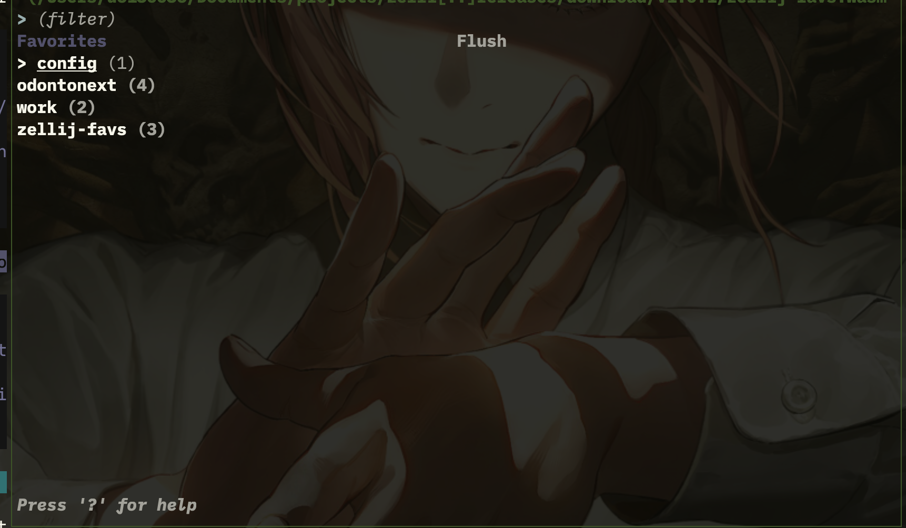
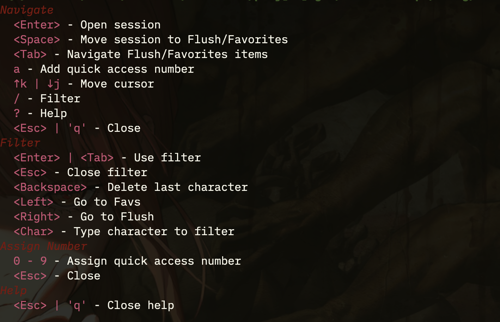

# Zellij Favs a plugin for [Zellij](https://github.com/zellij-org/zellij)

A simple and intuitive plugin for managing favorite sessions in Zellij. With zellij-favs, you can keep your favorite sessions organized and easily flush away the unwanted ones.



# Features

- Filter Sessions: Use / to filter through your sessions quickly.
- Switch Between Lists: Press Tab to toggle between the "Favorites" and "Flush" lists.
- Move Sessions: Select a session and press Space to move it between the lists.
- Quick Number Access: Press A to assign numbers (0-9) to sessions, then use those numbers for instant access.
- Flush Unwanted Sessions: Press F to remove all non-favorite sessions.
- Access Sessions: Press Enter, Left Arrow, or Right Arrow to access the highlighted session.

## Usage

- Filtering:
  Press / and start typing to filter sessions.
  After filtering, press Enter to return to the sessions list.

- Switching Lists:
  Press Tab to switch between the "Favorites" and "Flush" lists.

- Managing Sessions:
  Highlight a session and press Space to move it between "Favorites" and "Sessions."

- Quick Number Assignment:
  Press A to enter assign mode, then press any digit (0-9) to assign that number to the highlighted session.
  Once assigned, press the number key to instantly access that session from anywhere in the plugin.

- Flushing Sessions:
  Press F to flush all unwanted sessions from the list.

- Accessing a Session:
  Highlight a session and press Enter to open it.
  Or use assigned number keys (0-9) for instant access to numbered sessions.

- Close panel plugin:
  Press Esc to exit the plugin



# Installation

1. Install the plugin using the following command:

```sh
mkdir -p ~/.config/zellij/plugins && \
curl -L https://github.com/JoseMM2002/zellij-favs/releases/download/v1.0.1/zellij-favs.wasm -o ~/.config/zellij/plugins/zellij-favs.wasm
```

2. Add the following keybind to your Zellij [configuration](https://zellij.dev/documentation/configuration.html) file:

```kdl
shared_except "locked" {
    bind "Ctrl {char}" {
        LaunchOrFocusPlugin "file:~/.config/zellij/plugins/zellij-favs.wasm" {
            floating true
            cache_dir "/path/to/cache/file"
        }
    }
}
```

## Alternatively, you can use the following configuration:

```kdl
bind "Ctrl {char}" {
    LaunchOrFocusPlugin "https://github.com/JoseMM2002/zellij-favs/releases/download/v1.0.1/zellij-favs.wasm" {
        floating true
        cache_dir "/path/to/cache/file"
    }
}
```

# Goals

- [x] Make a plugin that allows users to manage their favorite sessions in Zellij.
- [x] Keep the plugin data available and synchronized on multiple terminal sessions.
- [x] Keep the plugin data after reboot
- [x] Add pane to show plugin commands and keybinds.

# Contributing

If you have any ideas, feel free to open an issue or a pull request.
This is my first project in Rust, so any feedback is welcome.
Thank you for your support!
